# Security Analysis System - Workflow Diagram

## Complete Workflow Architecture

```mermaid
graph TB
    Start([User Query]) --> SupervisorPre[Supervisor Pre<br/>Job Classification]
    
    SupervisorPre --> Route{Job Type?}
    
    %% Log Analysis Path
    Route -->|log_analysis| FetchLogs[Fetch Logs<br/>Splunk/File/MCP]
    FetchLogs --> Normalize[Normalize<br/>Parse & Structure]
    Normalize --> Chunk[Chunk<br/>Split Large Datasets]
    Chunk --> Analyze[Analyze<br/>LLM Detection]
    Analyze --> Merge[Merge Results<br/>Combine Chunks]
    Merge --> Summary[Summary<br/>Generate Findings]
    Summary --> ExportCSV[Export CSV<br/>Attack Events]
    ExportCSV --> SupervisorPost[Supervisor Post<br/>Update Flags]
    
    %% Post-Supervisor Routing
    SupervisorPost --> CheckTI{Need TI?}
    CheckTI -->|Yes| TI[TI Agent<br/>Threat Intelligence]
    CheckTI -->|No| CheckRecommend
    TI --> Asset[Asset Enrichment<br/>IP Mapping]
    
    %% Asset Routing
    Asset --> CheckGenRule{Need GenRule?}
    CheckGenRule -->|Yes| GenRule[GenRule Agent<br/>Detection Rules]
    CheckGenRule -->|No| CheckRecommend
    GenRule --> CheckRecommend
    
    %% Recommend & Report
    CheckRecommend{Need Recommend?} -->|Yes| Recommend[Recommend Agent<br/>Security Advice]
    CheckRecommend -->|No| CheckReport
    Recommend --> CheckReport{Need Report?}
    CheckReport -->|Yes| Report[Report Agent<br/>PDF Generation]
    CheckReport -->|No| CheckTelegram
    Report --> CheckTelegram
    
    %% IP Reputation Path
    Route -->|ip_reputation| TI
    
    %% Generic Rule Path
    Route -->|generic_rule| QueryRAG[QueryRAG Agent<br/>Knowledge Base]
    QueryRAG --> GenRule
    
    %% Knowledge Query Path
    Route -->|knowledge_query| QueryRAG
    
    %% Asset Query Path
    Route -->|asset_query| Asset
    Asset --> AssetRoute{Has Query?}
    AssetRoute -->|Yes| QueryRAG
    AssetRoute -->|No| End
    
    %% Final Steps
    CheckTelegram{Send Telegram?} -->|Yes| Telegram[Telegram Notifier<br/>Alert]
    CheckTelegram -->|No| End
    Telegram --> End([Response to User])
    
    %% Styling
    classDef supervisor fill:#667eea,stroke:#764ba2,color:#fff
    classDef agent fill:#f093fb,stroke:#f5576c,color:#fff
    classDef io fill:#4facfe,stroke:#00f2fe,color:#fff
    classDef processing fill:#43e97b,stroke:#38f9d7,color:#000
    classDef decision fill:#fa709a,stroke:#fee140,color:#fff
    
    class SupervisorPre,SupervisorPost supervisor
    class Analyze,TI,Recommend,Report,GenRule,QueryRAG agent
    class FetchLogs,ExportCSV,Telegram io
    class Normalize,Chunk,Merge,Summary,Asset processing
    class Route,CheckTI,CheckGenRule,CheckRecommend,CheckReport,CheckTelegram,AssetRoute decision
```



## Node Details

### 🎯 Supervisor Nodes
- **supervisor_pre**: Phân loại job type (log_analysis, ip_reputation, generic_rule, knowledge_query, asset_query)
- **supervisor_post**: Cập nhật workflow flags dựa trên findings

### 🤖 Agent Nodes
- **analyze**: Phát hiện tấn công bằng LLM (AnalyzeAgent)
- **ti**: Threat intelligence - AbuseIPDB & VirusTotal (TIAgent)
- **recommend**: Khuyến nghị bảo mật (RecommendAgent)
- **report**: Tạo báo cáo PDF (ReportAgent)
- **genrule**: Tạo Sigma/SPL detection rules (GenRuleAgent)
- **queryrag**: Query knowledge base (QueryRAGAgent)

### 📥 I/O Nodes
- **fetch_logs**: Lấy logs từ Splunk/File/MCP
- **export_csv**: Xuất attack events ra CSV
- **send_telegram**: Gửi alert qua Telegram

### ⚙️ Processing Nodes
- **normalize**: Parse và chuẩn hóa logs
- **chunk**: Chia nhỏ dataset lớn
- **merge_results**: Gộp kết quả từ các chunks
- **summary**: Tạo findings summary
- **asset**: Enrichment với asset information

## Workflow Paths

### 1. Log Analysis (Full Path)
```
User Query → supervisor_pre → fetch_logs → normalize → chunk → 
analyze → merge_results → summary → export_csv → supervisor_post → 
ti → asset → genrule → recommend → report → telegram → END
```

### 2. IP Reputation Check
```
User Query → supervisor_pre → ti → asset → END
```

### 3. Generic Rule Generation
```
User Query → supervisor_pre → queryrag → genrule → END
```

### 4. Knowledge Query
```
User Query → supervisor_pre → queryrag → END
```

### 5. Asset Query
```
User Query → supervisor_pre → asset → queryrag → END
```

## Routing Logic

### Job Type Classification
```python
if has_log_source and has_time_range:
    job_type = "log_analysis"
elif has_ip_addresses:
    job_type = "ip_reputation"
elif wants_detection_rules:
    job_type = "generic_rule"
elif wants_asset_info:
    job_type = "asset_query"
else:
    job_type = "knowledge_query"
```

### Conditional Routing
```python
# After supervisor_post
need_ti = (severity in ["high", "critical"])
need_genrule = user_enabled_genrule
need_recommend = has_attacks
need_report = has_attacks
send_telegram = user_preference and has_attacks
```

## Performance Metrics

| Node | Avg Time | Max Events |
|------|----------|------------|
| fetch_logs | 1-5s | 10,000 |
| normalize | 0.1-0.5s | 10,000 |
| chunk | 0.01s | unlimited |
| analyze | 2-10s | 100/chunk |
| ti | 1-3s/IP | 10 IPs |
| genrule | 5-15s | - |
| report | 3-8s | - |

## Error Handling

Tất cả nodes đều có error handling:
- Non-critical nodes: Log error và continue
- Critical nodes: Return error state
- Workflow: Always completes, never hangs

## Caching

- **TI Cache**: 24h TTL, persistent
- **RAG Cache**: In-memory, session-based
- **Asset Cache**: Loaded on startup

---

**Để xem diagram:**
1. Copy mermaid code
2. Paste vào https://mermaid.live
3. Hoặc xem trong GitHub/GitLab (tự động render)
